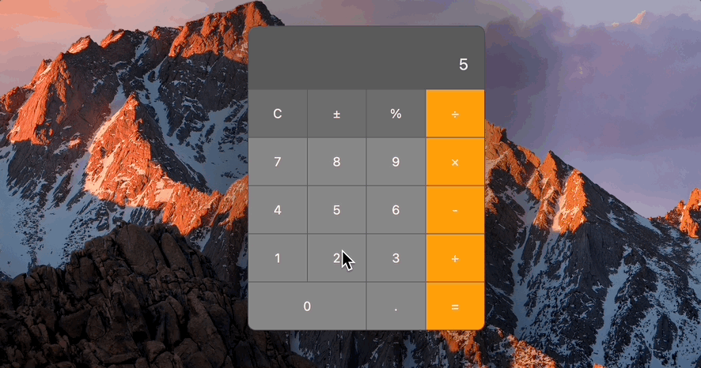

# Design a Calculator Application

A macOS replica calculator built with vanilla `JavaScript, HTML, and CSS`!

---

## Installation

As this is as simple as a web application gets, there are zero `node.js` or front-end framework installation requirements.

Simply `git clone` the repository and start up the app with the `Live Server` extension for VSCode. This will automatically open your preferred localhost port in the web browser of your choosing.

If you don't already have the extension installed, you can download it [here](https://marketplace.visualstudio.com/items?itemName=ritwickdey.LiveServer).

---

## Functionality

The calculator supports the following operations and its behavior resembles that of the calculator app found on Mac computers:

- Basic Arithmetic (addition, subtraction, multiplication, division)
- Negate value
- Value as a percentage
- Clear Values
- Scientific Notation of solutions
- Font-size scaling based on length of output

---

## Design

The calculator has been designed to look and feel like your Mac calculator. It is also mobile reponsive based on a max window inner-width of 600px.

